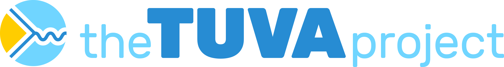

--- 
#title: "The Tuva Project"
title: |
  {width=7in}

site: bookdown::bookdown_site
output: bookdown::gitbook
documentclass: book
bibliography: [book.bib, packages.bib]
biblio-style: apalike
link-citations: yes
github-repo: tuva-health/docs
description: "A repository of knowledge for healthcare data practitioners."
---

# (PART) Welcome {.unnumbered}

# Introduction

## What is the Tuva Project?

The Tuva Project is an open source knowledge-base, code-base, and community for healthcare data practitioners.  The project was started by Aaron Neiderhiser and Coco Zuloaga.  After working in healthcare data science for more than a decade they became frustrated by what they saw as a lack of progress in the field.  From their standpoint, they saw every healthcare data engineer and data scientist solving the same problems over and over again with almost zero improvement in terms of data empowering better treatment and care delivery decisions.  

After thinking about it more, they realized healthcare data practitioners were being held back by one main fundamental problem: knowledge.  Doing healthcare data engineering and data science requires a tremendous amount of healthcare domain knowledge.  This comes up in almost every facet of the work we do: building measures and cohorts, pre-processing claims, normalizing lab data, stratifying high-risk patients.  A data practitioner needs knowledge not only about how to do these things but also the underlying data.  

Where does this knowledge live today?  It's institutional knowledge within healthcare analytics companies and healthcare data teams.  Those of us who have been in the industry long enough have had the experience of trying to learn something knew only to be told that we should "go talk to Susie on team X because she's the expert in the company on that topic."  

What's the problem with institutional knowledge?  It's often hidden and not accessible to everyone, so it doesn't scale.  As an industry we end up learning the same things over and over.

The Tuva Project was created to bring this knowledge out into the open.  It includes 3 main components:

- Knowledge: An open repository of healthcare domain knowledge for how to work with healthcare data (this site is the Knowledge Repo).

- Code: An open Github library of healthcare data infrastructure - we're translating healthcare knowledge to code so data practitioners can stop reinventing the wheel and focus on higher-leverage problems. <https://github.com/tuva-health>

- Community: An open Slack community where healthcare data practitioners can go to get answers to difficult healthcare data problems, learn about the latest trends in healthcare data and network about career opportunities in healthcare data. <https://join.slack.com/t/thetuvaproject/shared_invite/zt-16iz61187-G522Mc2WGA2mHF57e0il0Q>

The goal of Knowledge and Community is to move the industry from institutional knowledge to open knowledge.  The goal of Code is to create give data practitioners a foundation of healthcare data infrastructure they can build on.

Notice the emphasis on "open".  The other thing that's been missing in healthcare besides knowledge is open source.

## Why Open Source?

The basic problem is that healthcare knowledge and data infrastructure is closed. 

Today, knowledge is closed and institutional.  Try googling about almost any topic in healthcare data and see how far you get.  In addition, there is no place practitioners can congregate and learn from each other.  

Today, data infrastructure is closed.  Either your company (vendor, health system, payer, pharma, etc.) is building this from scratch or paying a vendor who built it from scratch millions of dollars.  

That's why open source is a foundational component of how we solve this problem.  By making knowledge and data infrastructure open, we give individuals and organizations a platform they can build on and grow.  We can stop the cycle of building the same thing over and over.

## What is Tuva Health?

Tuva Health is the for-profit company behind the Tuva Project.  We're a team of expert healthcare data engineers and scientists totally focused on solving this problem.  Being a for-profit company is extremely important because over time it allows us to make significantly larger R+D investment in the open source which substantially increases the probability that we'll achieve our mission of solving this problem for the entire industry.

Our business model is to support organizations in adopting the Tuva Project.  The Tuva Project is open source and licensed under Apache 2.  Individuals and organizations are free to try out, adopt, or fork (customize) any part of the Tuva Project for any reason.  However some organizations need help adopting the Tuva Project, either because they lack the expertise or people to implement it.  That's where we come in.  We do everything from helping organizations get up and runniing to fully managing the Tuva Project for them, all within their cloud environment.
